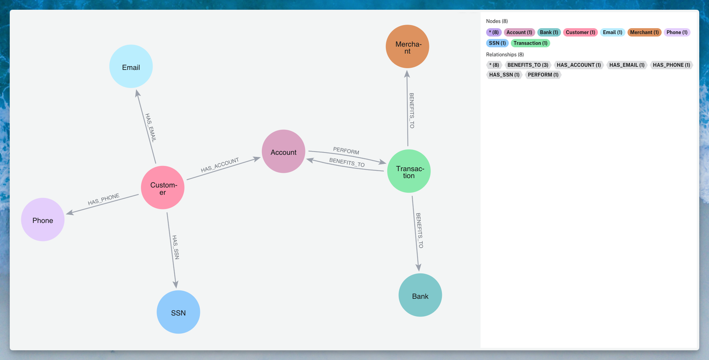

# 🔍 Super Node Detection for Fraud Prevention

> **Enhance fraud detection accuracy by identifying and filtering super nodes in Neo4j graphs**

## 🎯 Quick Start

Super nodes are highly connected nodes that often represent dirty data rather than actual fraudulent patterns. This project helps you identify and manage these nodes to improve fraud detection in financial networks.

## 📊 The Problem

### Why Super Nodes Matter

In production databases, data quality issues create artificial connections that obscure real fraud patterns:

| Data Type | Common Default Values | Impact |
|-----------|----------------------|--------|
| **Email** | `test@test.com`, `noemail@test.com` | False customer links |
| **Phone** | `000-000-0000`, `999-999-9999` | Artificial connections |
| **Address** | `123 Main St`, `NULL`, `N/A` | Geographic clustering |
| **SSN** | `000-00-0000`, `123-45-6789` | Identity confusion |

These placeholder values become **super nodes** - creating thousands of false connections between unrelated entities.

## 🗂️ Graph Data Model



### Node Types

| Node | Color | Description |
|------|-------|-------------|
| **Customer** | 🔴 Pink | Individual customers |
| **Account** | 🟣 Purple | Bank accounts |
| **Transaction** | 🟢 Green | Financial transactions |
| **Bank** | 🟦 Teal | Financial institutions |
| **Merchant** | 🟠 Orange | Transaction recipients |
| **Email** | 🔵 Light Blue | Email addresses |
| **Phone** | 🟪 Lavender | Phone numbers |
| **SSN** | 🔷 Blue | Social Security Numbers |

### Relationship Types

```cypher
(:Customer)-[:HAS_EMAIL]->(:Email)
(:Customer)-[:HAS_PHONE]->(:Phone)
(:Customer)-[:HAS_SSN]->(:SSN)
(:Customer)-[:HAS_ACCOUNT]->(:Account)
(:Account)-[:PERFORM]->(:Transaction)
(:Transaction)-[:BENEFITS_TO]->(:Account|:Bank|:Merchant)
```

## 🔬 Detection Strategy

### 🎯 Primary Targets

We focus on three critical super node types for synthetic identity fraud:

| Priority | Node Type | Why It Matters |
|----------|-----------|----------------|
| **1** | 📱 Phone Numbers | Most commonly reused/defaulted |
| **2** | 🆔 SSNs | Shared across synthetic identities |
| **3** | 📧 Email Addresses | Frequent placeholder values |

### 📈 Algorithm Suite

#### 1. **Degree Centrality** 
> Identifies nodes with abnormally high connections

```cypher
CALL gds.degree.write('customerDegreeGraph', {
    orientation: 'UNDIRECTED',
    writeProperty: 'degreeScore'
})
YIELD centralityDistribution;
```

- **Output**: Nodes exceeding normal connection patterns (typically >50 connections indicates super node)
- [📖 Full Implementation Guide](DEGREE_CENTRALITY.md) | [Neo4j Documentation](https://neo4j.com/docs/graph-data-science/current/algorithms/degree-centrality/)

#### 2. **Articulation Points**
> Finds critical bridge nodes in the network

```cypher
CALL gds.articulationPoints.write('customerArticulationGraph', { 
    writeProperty: 'articulationPoint'
})
YIELD articulationPointCount;
```

- **Key Insight**: Real fraud networks have redundant connections; dirty data creates single failure points
- [📖 Neo4j Documentation](https://neo4j.com/docs/graph-data-science/current/algorithms/articulation-points/)

#### 3. **Community Detection + Bridge Analysis**
> Identifies nodes unnaturally connecting separate communities

```cypher
TBC
```

- **Method**: Detect communities → Find multi-community nodes
- **Result**: Nodes artificially linking unrelated groups

## 💡 Real-World Use Cases

### 🎭 Synthetic Identity Fraud

**The Pattern:**
```
Fake Identity = Real SSN + Fake Phone + Fake Email + Fake Address
```

**Detection Strategy:**
1. Filter out super nodes (dirty data)
2. Find SSNs with suspicious connection patterns
3. Identify velocity changes in identity creation

### 🏦 First-Party Fraud

**The Pattern:**
```
Legitimate Customer → Commits Fraud → Networks with Accomplices
```

**Detection Strategy:**
1. Exclude coincidental connections (super nodes)
2. Focus on deliberate network formation
3. Monitor behavioral changes over time

---

## 📚 Resources

- [Neo4j Graph Data Science Documentation](https://neo4j.com/docs/graph-data-science/)
- [Fraud Detection Best Practices](https://neo4j.com/use-cases/fraud-detection/)
- [Community Forum](https://community.neo4j.com/)