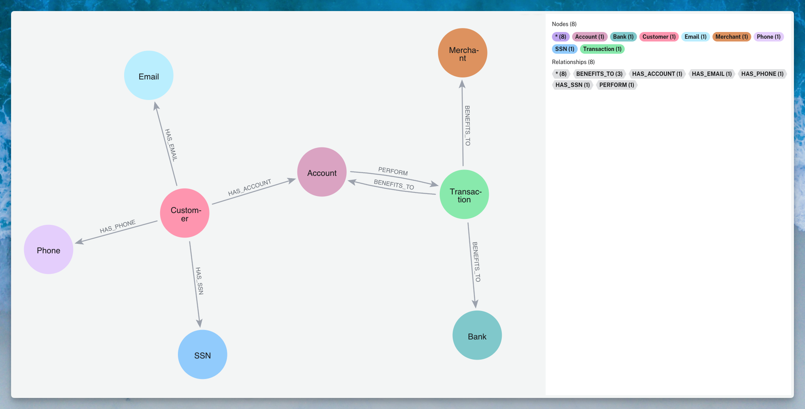

# Super-Connector Detection for Fraud Prevention

## Overview

This project focuses on identifying and managing super-connectors in Neo4j graphs to improve fraud detection accuracy. Super-connectors are highly connected nodes that often represent dirty data rather than actual fraudulent patterns. By identifying and filtering these nodes, we can enhance the detection of genuine fraud cases, particularly in synthetic identity fraud scenarios.

### The Problem

In real-world databases, data quality issues are common:
- Required fields that cannot be null lead to default values
- Users enter placeholder data like:
  - Email: `test@test.com`, `noemail@test.com`
  - Phone: `000-000-0000`, `999-999-9999`
  - Address: `123 Main St`, `NULL`, `N/A`
  - SSN: `000-00-0000`, `123-45-6789`

These default values become super-connectors in graph databases, creating false connections between unrelated entities and obscuring actual fraudulent patterns.

## Data Model

The graph model focuses on customer identity verification and transaction patterns:

### Nodes
- **Customer** (pink): Core entity representing individuals
- **Account** (purple): Bank accounts linked to customers
- **Transaction** (green): Financial transactions between accounts
- **Bank** (teal): Financial institutions
- **Merchant** (orange): Transaction recipients
- **Email** (light blue): Email addresses associated with customers
- **Phone** (lavender): Phone numbers linked to customers
- **SSN** (blue): Social Security Numbers for identity verification

### Relationships
- `HAS_EMAIL`: Customer → Email
- `HAS_PHONE`: Customer → Phone
- `HAS_SSN`: Customer → SSN
- `HAS_ACCOUNT`: Customer → Account
- `PERFORM`: Account → Transaction
- `BENEFITS_TO`: Transaction → Account/Bank/Merchant

## Detection Strategy

### Primary Focus: Identity Attributes
For synthetic identity fraud detection, we concentrate on three key super-connector types:
1. **Phone Numbers** - Often reused or defaulted
2. **Social Security Numbers** - Shared across synthetic identities
3. **Email Addresses** - Common placeholder values

### Approach

We employ multiple Graph Data Science (GDS) algorithms to identify super-connectors:

#### 1. Degree Centrality
Identifies nodes with unusually high connection counts.
- **Use Case**: Find phone numbers, emails, or SSNs connected to an abnormal number of customers
- **Threshold**: Nodes with degree > statistical outlier (e.g., mean + 3*std dev)
- [Documentation](https://neo4j.com/docs/graph-data-science/current/algorithms/degree-centrality/)

#### 2. Articulation Points
Discovers critical nodes whose removal would disconnect the graph.
- **Use Case**: Identify data points that artificially bridge unrelated customer clusters
- **Insight**: True fraud networks remain connected through multiple paths; dirty data creates single points of failure
- [Documentation](https://neo4j.com/docs/graph-data-science/current/algorithms/articulation-points/)

#### 3. Community Detection + Bridging Analysis
Combination approach to find nodes that unnaturally connect distinct communities.
- **Use Case**: Detect default values linking unrelated customer segments
- **Method**: Run community detection, then analyze nodes connecting multiple communities

## Implementation Goals

1. **Identify Super-Connectors**: Use GDS algorithms to flag potential dirty data nodes
2. **Classify Node Types**: Distinguish between:
   - Dirty data (default values)
   - Legitimate high-connectivity (e.g., corporate phone numbers)
   - Actual fraud patterns
3. **Query Optimization**: Exclude identified super-connectors from fraud detection queries
4. **Continuous Monitoring**: Regularly update super-connector lists as new data arrives

## Expected Outcomes

- **Reduced False Positives**: Eliminate dirty data from fraud alerts
- **Improved Query Performance**: Avoid traversing super-connector nodes
- **Better Fraud Detection**: Focus on genuine suspicious patterns
- **Data Quality Insights**: Identify sources of dirty data for upstream correction

## Next Steps

1. Implement baseline degree centrality analysis
2. Test articulation point detection on sample data
3. Develop classification rules for super-connector types
4. Create exclusion lists for fraud detection queries
5. Build monitoring dashboard for ongoing super-connector management

## Use Cases

### Synthetic Identity Fraud
Fraudsters create fake identities by combining:
- Real SSNs (often stolen or synthetic)
- Multiple phone numbers and emails
- Various addresses

By filtering out super-connectors, we can better identify genuine synthetic identity patterns where fraudsters reuse specific identity components across multiple fake profiles.

### First-Party Fraud
Legitimate customers who commit fraud often:
- Use their real information initially
- Create connections to accomplices
- Share certain contact details

Super-connector detection helps distinguish between coincidental connections (dirty data) and intentional fraud networks.